<style>
h1 {
    text-align: center;
}
h2, h3 {
    page-break-after: avoid; 
}
.center {
    margin: 0 auto;
    width: fit-content;
    margin-top: 2em;
    padding-top: 0.5em;
    padding-bottom: 0.5em;
    margin-bottom: 2em;
}
.title {
    font-weight: bold;
    border-top-style: solid;
    border-bottom-style: solid;
}
.newpage {
    page-break-after: always
}
@media print {
    @page {
        margin: 3cm;
    }
}
</style>

<h1 style="margin-top: 4em">
软件工程实验报告
</h1>

# <h1 class="center title">实验四：等价判断</h1>

<div class="center">
<h3>院系：人工智能学院</h3>
<h3>姓名：方盛俊</h3>
<h3>学号：201300035</h3>
<h3>班级：人工智能 20 级 2 班</h3>
<h3>邮箱：201300035@smail.nju.edu.cn</h3>
<h3>时间：2022 年 10 月 31 日</h3>
</div>

<div class="newpage"></div>

<!-- 生成目录 -->

## <h1>目录</h1>

[TOC]

<div class="newpage"></div>

<!-- 文章主体内容 -->

## 一、版本控制

在进行版本控制之前，先按照上一次实验书写的实验报告，初始化好项目结构：

```txt
.
│  .gitignore  (不加入 Git 里的文件)
│  lab4-report-201300035.md  (实验报告)
│  main.py  (项目主入口)
│  requirements.txt  (Python 依赖文件)
├─cluster
├─data  (示例数据)
│  ├─input
│  │  ├─4A
│  │  │      101036360.cpp
│  │  │      117364748.cpp
│  │  │      127473352.cpp
│  │  │      134841308.cpp
│  │  │      173077807.cpp
│  │  │      48762087.cpp
│  │  │      84822638.cpp
│  │  │      84822639.cpp
│  │  │      stdin_format.txt
│  │  └─50A
│  │          138805414.cpp
│  │          142890373.cpp
│  │          164831265.cpp
│  │          21508887.cpp
│  │          21508898.cpp
│  │          21715601.cpp
│  │          29019948.cpp
│  │          30534178.cpp
│  │          31034693.cpp
│  │          33794240.cpp
│  │          36641065.cpp
│  │          45851050.cpp
│  │          stdin_format.txt
│  └─output
├─diff
├─generator
├─images
├─input
├─output
├─paracomp
└─server
```

### 1. Git Init

执行 `git init` 初始化项目的 Git 仓库。

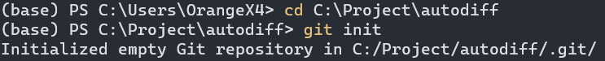

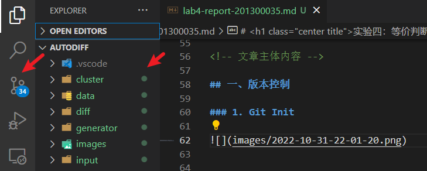

可见 VS Code 版本控制面板和目录树标绿，说明已经初始化完毕，正在等待将文件加入 Git 仓库中。

### 2. 编写 `.gitignore` 文件

编写 `.gitignore` 文件，将无需加入 Git 仓库的文件标在这里。

```gitignore
# Byte-compiled / optimized / DLL files
__pycache__/
*.py[cod]
*$py.class

# Executables
*.exe
*.out

# IDE/Editor configuration
.vscode/

# Filesystem file
.DS_Store
```

这是很重要的一步，可以避免无用文件被加入 Git 仓库里 (例如一些需要实时生成的二进制文件和可执行文件，以及与 IDE 紧耦合的配置文件)。

### 3. Git Add

执行 `git add *` 将所有文件加入到 Git 仓库中。


执行前的 `git status`：

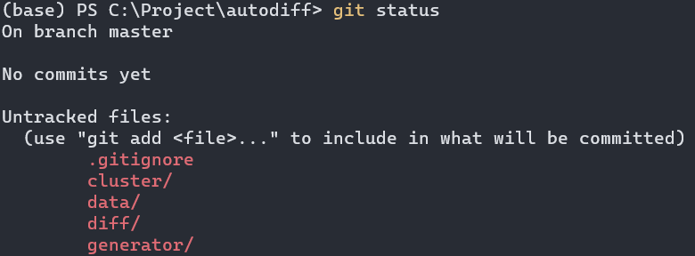

执行后的 `git status`：

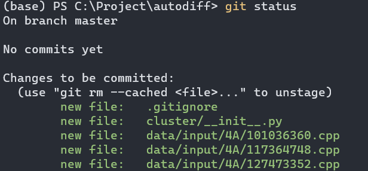

### 4. Git Commit

执行 `git commit -m "feat: init"` 进行一次初始化的 Commit，并附上 Commit 信息 `feat: init`。

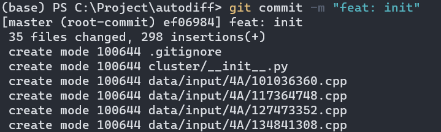

执行前的 `git status`：


执行后的 `git status`：

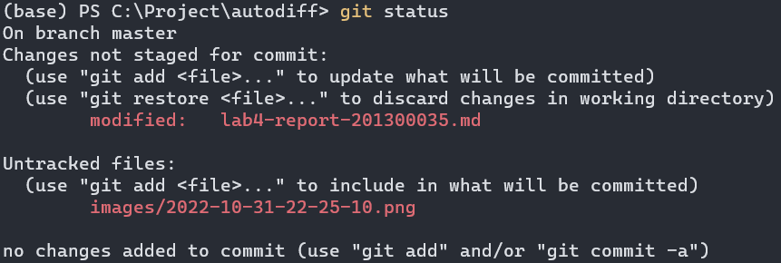

### 5. Git Diff

`main.py` 的内容原本为：

```python
print('Hello World')
```

为了进行一次 Commit，我们将其修改为：

```python
print('Hello World')
print('Hello Software Engineering')
```

执行 `git add *` 后执行 `git commit -m "feat: change main.py"`，将变动 Commit 到 Git 仓库中。

执行 `git diff` 我们可以发现我们的更改切实地被加入到了 Git 仓库中。

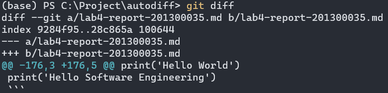

### 6. Git Reset

Git Reset 命令用于重置当前 HEAD 到指定的版本。

执行 `git log` 我们可以看出我们当前有 `feat: init` 和 `feat: change main.py` 这两条 Commit。

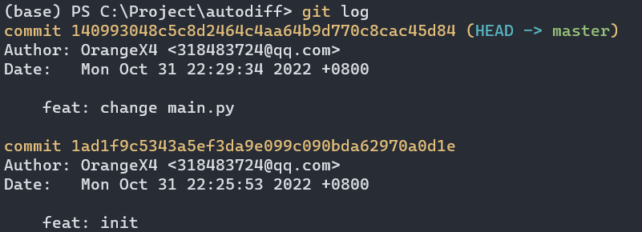

执行 `git reset 1ad1f9` 我们就可以恢复到 `feat: init` 这一条 Commit 所在的位置。

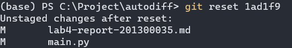

执行 `git log`，我们发现我们确实已经回到了只有一条 Commit 的状态。

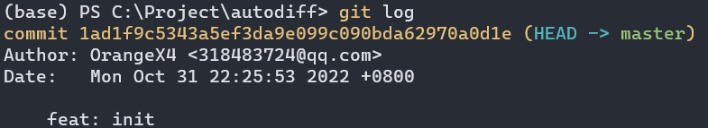

### 7. Git Revert

使用 Git Revert 命令和 Git Reset 很类似，均是要恢复到之前的某些版本，但是 Git Revert 的好处在于，会把之前的 commit history 给保留下来，并把这次撤销作为一个新的 Commit。

执行 `git reset 1409930` 来恢复 `feat: change main.py` 这条 Commit，并执行 `git log` 显示：

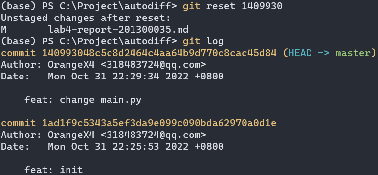

执行 `git revert HEAD`，我们就能撤销当前版本的修改，恢复上一个版本，并在不改变 commit history 的情况下，创建一个新的 Commit。

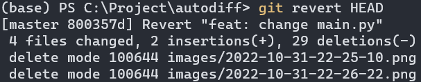

我们可以看出，`main.py` 文件的内容也成功回退到上一个版本了。

执行 `git log` 我们可以更清晰地看出我们做的操作：

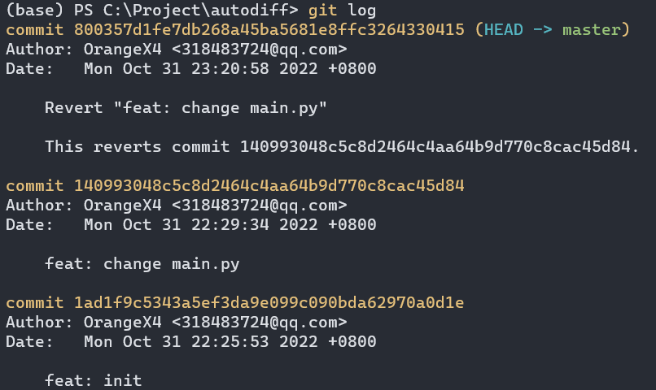

再次执行 `git revert HEAD`，我们可以发现 `main.py` 又恢复到了最新版本，这大概就是 `git revert` 操作的“负负得正”。

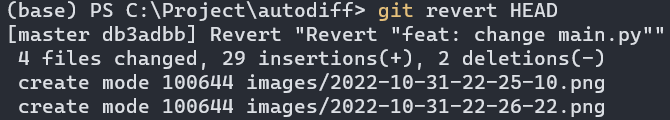

### 8. Git Stash

> 有时，当你在项目的一部分上已经工作一段时间后，所有东西都进入了混乱的状态， 而这时你想要切换到另一个分支做一点别的事情。 问题是，你不想仅仅因为过会儿回到这一点而为做了一半的工作创建一次提交。 针对这个问题的答案是 `git stash` 命令。

这是 Git 官方文档对 Git Stash 命令的解释。事实上我也确实用到了这个命令。

在上一小节的 Git Revert 命令演示中，由于我是在同步编写实验报告，所以工作区实际上有一些变动，这导致我无法正常 `git revert`。

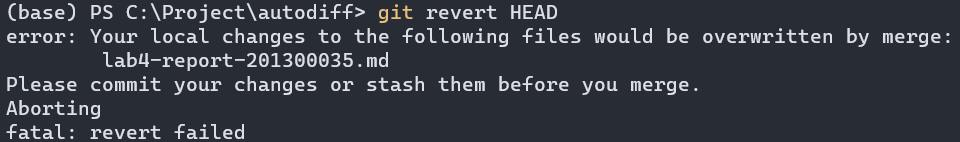

这种时候，我就可以执行 `git stash`，将我对实验报告的修改暂存了起来，这样工作区就又恢复了干净的状态，同时我们可以用 `git stash list` 查看我们放在栈上的暂存修改。

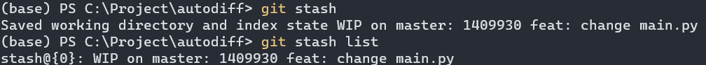

在我们做完了其他工作，想要恢复暂存的修改的时候，就可以执行 `git stash apply` 将修改恢复过来了。

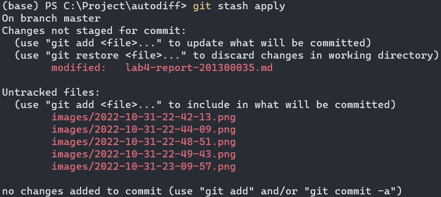

### 8. Git Checkout

执行 `git checkout -b dev` 创建 `dev` 分支，并使用 `git branch` 查看。

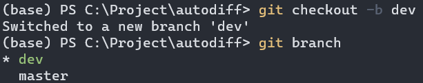

使用 `git checkout master` 和 `git checkout dev` 可以切换分支。

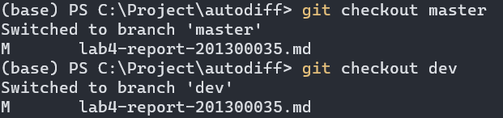

### 9. Git Merge

我们修改 `main.py` 的内容为，并 Commit 到 `dev` 分支上：

```python
print('Hello World')
print('Hello Software Engineering')
print('New Branch')
```

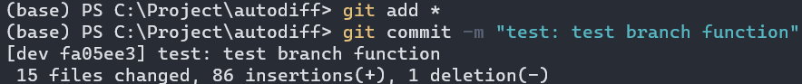

我们执行 `git checkout master` 后执行 `git merge dev` 进行合并。

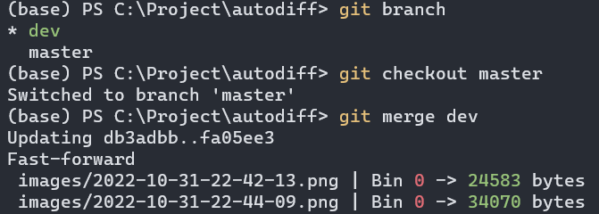

执行 `git log --graph --decorate --oneline --all` 可以看出中途 `dev` 分支被分离了出去，进行了一次 Commit 之后才被合并的。

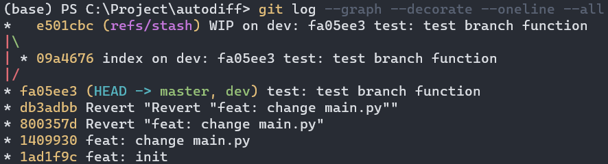

### 10. Git Rebase

除了 Git Merge 命令之外，还有一种可以对分支进行合并的命令，即 Git Rebase 命令。

要理解 Git Rebase 命令其实很简单，我们知道每个版本其实保存了一个类似于父节点的指针，通过父节点指针我们就可以从 HEAD 一路找到初始化版本，并通过 Git Log 显示出来。理论上来说这个父节点指针不应该由我们控制，应该由 Git 自己管理，但是执行 Git Rebase 操作可以让我们更改分支的父节点指针，让当前分支的父节点指向另一个分支的最新节点，也就是“变基”操作。

我们先在 master 分支对 `main.py` 进行一点修改：

```python
print('Hello World')
print('Hello Software Engineering')
print('New Branch')
print('Change For Branch Master')
```

然后执行 `git add *` 和 `git commit -m "fix: change for branch master"` 进行 Commit。

执行 `git checkout dev` 切换到 `dev` 分支，并且同样在 master 分支对 `main.py` 进行一点修改：

```python
print('Hello World')
print('Hello Software Engineering')
print('New Branch')
print('Change For Branch Dev')
```

然后执行 `git add *` 和 `git commit -m "fix: change for branch dev"` 进行 Commit。

此时我们执行 `git log --graph --decorate --oneline --all` 看一下情况：

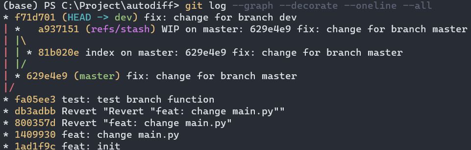

最关键的一步来了，我们执行 `git rebase master` 进行变基，将 dev 的父节点设为 master 的最新节点。

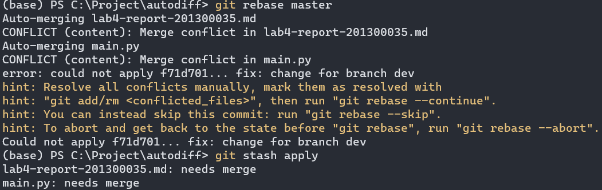

我们再次执行 `git log --graph --decorate --oneline --all` 看一下情况：

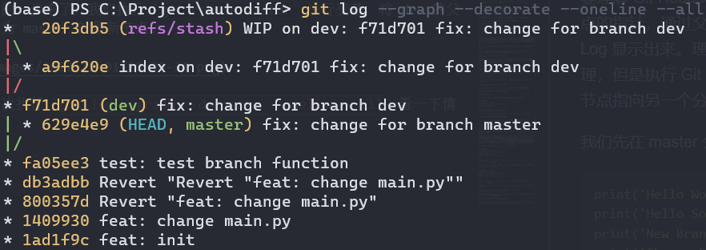

最后我们执行 `git checkout master` 和 `git merge dev` 让 master 分支行进到最新的节点。

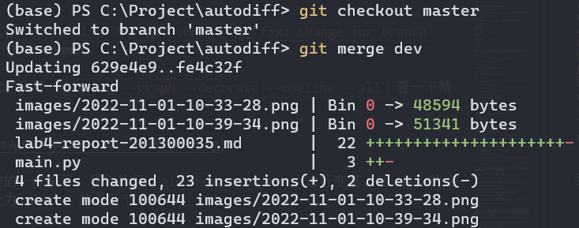

### 11. Git Cherry Pick

> 对于多分支的代码库，将代码从一个分支转移到另一个分支是常见需求。
> 这时分两种情况。一种情况是，你需要另一个分支的所有代码变动，那么就采用合并（git merge）。另一种情况是，你只需要部分代码变动（某几个提交），这时可以采用 Cherry Pick。

因此我们可以知道，Git Cherry Pick 命令很类似 Git Merge 命令，只不过可以选择合并某个 Commit 而不是合并某个分支。

我们执行 `git checkout dev` 切换到 dev 分支后，添加两个 Commit。

可以看出，我们当前有两个新的 Commit：`feat: change 1` 和 `feat: change 2`。

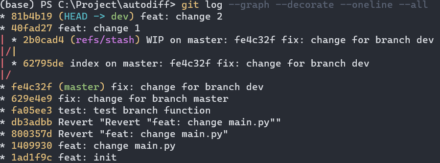

我们执行 `git checkout master` 切换到 master 分支后，然后执行 `git cherry-pick 40fad27` 只合并 dev 分支的 `feat: change 1`。

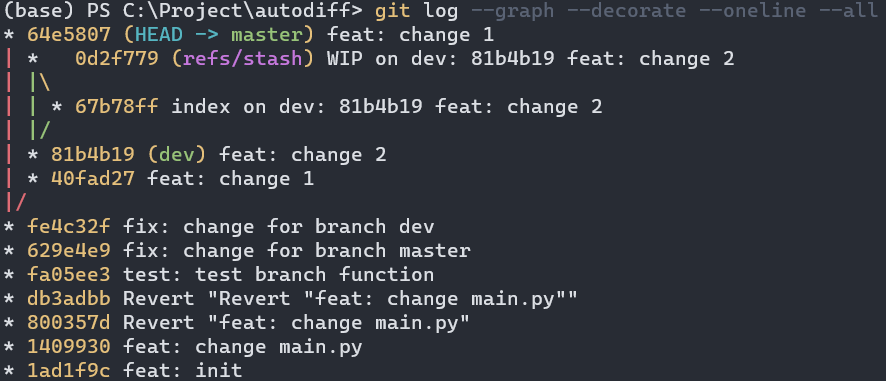

可以看到，我们的 master 分支确实合并了 `feat: change 1` Commit。

### 12. GitHub 远程仓库

我们先在 GitHub 上创建一个新的 Repo。

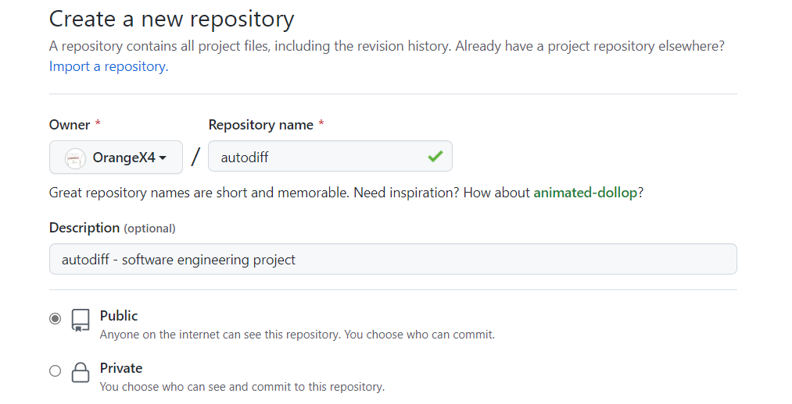

执行

```sh
git remote add origin https://github.com/OrangeX4/autodiff.git
git push -u origin master
git push origin dev
```

将所有分支推送上去。

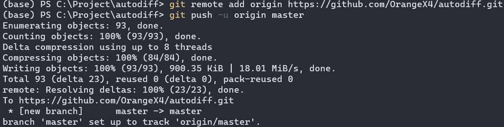

可以看见在地址 https://github.com/OrangeX4/autodiff/tree/master 已经成功推送了上去。

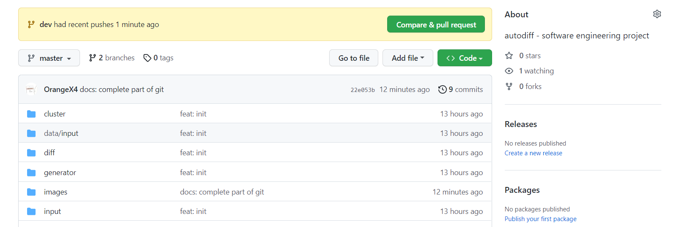


## 二、代码架构

### 1. 执行比较 (diff)

diff 模块是执行比较的核心模块，在这里我们使用 Python 中 subprocess 模块的 Popen 函数实现。

想要进行比较，我们必须先将源代码文件编译为可执行文件，再执行可执行文件，并向其输入我们生成的输入文本，然后获取输出结果。

我编写了一个类 `Executor`，由其来负责「编译」和「执行」两个功能。

```python
class Executor:

    def __init__(self, execute_cmd: str, build_cmd=None, clean_cmd=None) -> None:
        '''
        execute_cmd: 用于执行可执行程序的命令
        build_cmd: 用于构建可执行程序的命令
        clean_cmd: 用于清理可执行程序的命令
        '''
        self.execute_cmd = execute_cmd
        self.build_cmd = build_cmd
        self.clean_cmd = clean_cmd

    def _exec(self, file: str, cmd) -> None:
        if cmd is None:
            return
        cmd = format_string_with_file(cmd, file)
        process = Popen(cmd, stdout=PIPE, stderr=PIPE)
        process.communicate()

    def build(self, file: str) -> None:
        self._exec(file, self.build_cmd)

    def clean(self, file: str) -> None:
        self._exec(file, self.clean_cmd)

    def execute(self, file: str, input: str) -> str:
        cmd = format_string_with_file(self.execute_cmd, file)
        process = Popen(cmd, stdout=PIPE, stderr=PIPE, stdin=PIPE)
        output, err = process.communicate(input=input.encode())
        if err:
            # raise Exception(err.decode())
            return err.decode()
        return output.decode()
```

其中我们通过 `process = Popen(cmd)` 来打开可执行程序，然后使用 `process.communicate(input)` 向可执行程序输入我们生成的输入文本，最后获取到输出 `output`。

借助这个 `Executor` 类，我们就可以用很具有扩展性的方式，为不同平台，乃至不同语言，注册不同的执行器。

```python
self.executor_map = {
    'c': {
        'Windows': Executor('{fileNoExtension}.exe', 'gcc {file} -o "{fileNoExtension}.exe"', 'del "{fileNoExtension}.exe"'),
        'Linux': Executor('./{fileNoExtension}.out', 'gcc {file} -o "{fileNoExtension}.out"', 'rm "{fileNoExtension}.out"')
    },
    'cpp': {
        'Windows': Executor('{fileNoExtension}.exe', 'g++ "{file}" -o "{fileNoExtension}.exe"', 'del "{fileNoExtension}.exe"'),
        'Linux': Executor('{fileNoExtension}.out', 'g++ "{file}" -o "{fileNoExtension}.out"', 'rm "{fileNoExtension}.out"')
    },
    'py': {
        'Windows': Executor('python "{file}"'),
        'Linux': Executor('python3 "{file}"')
    },
}
```

同时我也写了一个单元测试，单元测试的输出结果为：

```txt
input: 2
output: {'../data/input/4A/48762087.cpp': 'HELLO',
         '../data/input/4A/84822638.cpp': 'NO\r\n'}
result: False
```

说明该模块能够正常工作了。


### 2. 生成样例 (generator)

为了实现样例生成器，也即是将 `int(a, b)`, `char`, `string(a, b)` 替换为相应的随机值，这里我采用了正则表达式的方式实现。

核心代码为：

```python
def generate(self, input: str) -> str:
    '''
    int(a, b): a <= value(int) <= b
    char: 随机大小写字母
    string(a, b): 由 char 组成, a <= length(string) <= b
    '''
    def get_char():
        return chr(randint(97, 122) if randint(0, 1) else randint(65, 90))

    # 将 int(a, b), char, string(a, b) 替换为对应的值
    input = re.sub(r'int\(\s*(\d+)\s*,\s*(\d+)\s*\)',
        lambda x: str(randint(int(x.group(1)), int(x.group(2)))), input)
    input = re.sub(r'char', lambda x: get_char(), input)
    input = re.sub(r'string\(\s*(\d+)\s*,\s*(\d+)\s*\)',
        lambda x: ''.join([get_char() for _ in
            range(randint(int(x.group(1)), int(x.group(2))))]), input)
    return input
```

即是使用 Python 的 `re.sub(pattern, func, text)` 方法来实现匹配和替换。


### 3. 中间表示与等价类 (cluster)

我们使用一个中间表示类 Cluster，来表示我们当前处理的数据的状态。

```json
{
    "cluster_name": "4A",
    "random_input_generator": {
        "type": "stdin_format.txt",
        "content": "int(1, 3)"
    },
    "custom_input": [ "1", "2" ],
    "config": {
        "random_test_times": 10,
        "random_seed": 0,
    },
    "files": {
        "48762087.cpp": {
            "content": "int main() { return 0; }",
            "equiv_class": "48762087.cpp"
        },
        "84822638.cpp": {
            "content": "int main() { return 0; }",
            "equiv_class": "48762087.cpp"
        }
    },
    "equiv": [["48762087.cpp", "84822638.cpp"]],
    "unequiv": [],
    "diff": {
        "48762087.cpp": {
            "84822638.cpp": {
                "auto": "unknown",
                "manual": "equiv",
                "logic": "equiv"
            }
        },
        "84822638.cpp": {
            "48762087.cpp": {
                "auto": "unknown",
                "manual": "equiv",
                "logic": "equiv"
            }
        }
    }
}
```

其中 `files` 属性下的 `equiv_class` 用的是一个 **并查集结构**，我们用并查集来标识该文件所属的 **等价类**。

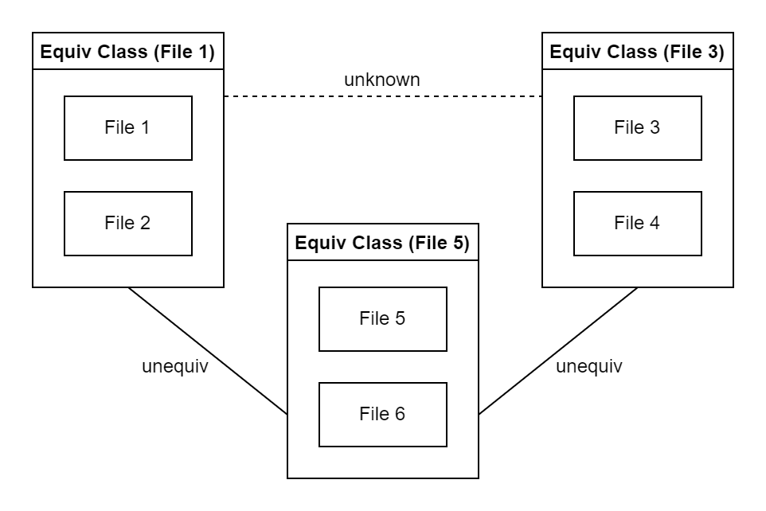

如图所示：

- 在同一个等价类里的文件被认为是 **相互等价** 的，通过一个根文件来表标识等价类，例如下面的那个等价类通过 `File 5` 标识。
- 在不同等价类之间，通过实线连接的等价类被认为是 **不等价** 的，即两个等价类里的文件两两匹配都不等价。
- 在不同等价类之间，通过虚线连接的等价类被认为是 **未知等价关系** 的，需要用户进一步地判断 (虚线是初始化后就存在的)。

借助这幅图所示的等价类概念，以及并查集的算法知识，我们就可以写出一个能够让用户 **手动动态更改等价关系** 的 Cluster 类。

由于代码有数百行，就不在报告中过多展示，感兴趣可以查阅代码 `cluster/__init__.py`。

代码还包括了一个简易的单元测试：

```python
cluster = Cluster('test', cluster)
cluster.clear()
cluster.set_manual('1', '2', 'equiv')
cluster.set_manual('2', '3', 'equiv')
cluster.set_manual('2', '3', 'unequiv')
cluster.set_manual('2', '3', 'unknown')
cluster.set_manual('3', '4', 'equiv')
cluster.set_auto('2', '3', 'unequiv')
cluster.update_diff()
print(cluster.cluster)
```

可以看出，接口是很易用的，可以在后续等价确认工具中使用。

### 4. 输入 (input)

输入模块负责把 `data/input` 里的文件读入，大部分都是繁杂的读入代码，这里就不再赘述。

代码中值得称道的一部分有，可以高拓展性地支持其他配置文件，除了 `stdin_format.txt` 外，我还添加了 `stdin_format.py` 和 `config.json` 等额外的配置文件，以及自定义测试样例，可以进行更灵活的随机样例生成和配置。

```python
with open(file_path, 'r', encoding='utf-8') as f:
    content = f.read()
    # 各种配置文件
    if file_name == 'stdin_format.txt':
        cluster['random_input_generator']['type'] = 'stdin_format.txt'
        cluster['random_input_generator']['content'] = content
    elif file_name == 'stdin_format.py':
        cluster['random_input_generator']['type'] = 'stdin_format.py'
    elif file_name == 'config.json':
        cluster['config'].update(json.loads(content))
    else:
        # 普通文件
        cluster['files'][file_name] = {
            'content': content,
            'equiv_class': file_name
        }
``` 

```python
if file_name == 'custom_input':
    # 自定义输入
    for custom_input_file_name in os.listdir(file_path):
        custom_input_file_path = os.path.join(
            file_path, custom_input_file_name)
        with open(custom_input_file_path, 'r', encoding='utf-8') as f:
            cluster['custom_input'].append(f.read())
```

### 5. 并行多进程计算 (paracomp)

为了实现并行地进行「**文件编译**」和「**文件比对**」，同时也因为 Python 的 GIL 机制导致无法正常多线程计算，这里我采用了 **多进程** 与 **进程池** 的策略来实现并行计算。

例如，在文件编译过程中，我使用了如下逻辑使得 `g++ xxx.cpp` 这个过程能够并行地进行：

```python
# 生成所有可执行文件
build_pool = multiprocessing.Pool(self.proc_num)
for file in cluster_dict['files']:
    file_path = os.path.abspath(os.path.join(
        self.path, 'input', cluster_name, file))
    build_pool.apply_async(self.diff.build, args=(file_path,))
build_pool.close()
build_pool.join()
```

而在文件比对部分，我也同样采取多进程的方式，进行样例生成与文件比对，大致代码如下:

```python
# 对文件对进行比较
diff_pool = multiprocessing.Pool(self.proc_num)
for file1 in cluster_dict["files"]:
    result[file1] = {}
    for file2 in cluster_dict["files"]:
        # 判断字符串大小, 保证不重复
        if file1 >= file2:
            continue
        # 为进程池加入任务
        result[file1][file2] = diff_pool.apply_async(
            self.diff_func, args=(cluster_name, file1, file2))
diff_pool.close()
diff_pool.join()
# 获取执行结果
for file1 in result:
    for file2 in result[file1]:
        res = result[file1][file2].get()
        cluster.set_auto(file1, file2, 'equiv' if res else 'unequiv')
cluster.update_diff()
```

在对比结束后，我们还会对可执行文件进行清理：

```python
# 清除可执行程序
for file in cluster_dict['files']:
    file_path = os.path.abspath(os.path.join(
        self.path, 'input', cluster_name, file))
    self.diff.clean(file_path)
```

最后，我同样写了一个单元测试进行验证：

```python
def unit_test():
    paracomp = Paracomp('../data', Input('../data'))
    print(paracomp.get_cluster_names())
    paracomp.run('4A')
    print(json.dumps(paracomp.input.clusters['4A'].cluster))
```

最后验证结果为多进程并行模块能够完美地发挥作用，由于我的电脑是 8 核处理器，我设定了进程池最大为 8 个进程，因此执行速度是原来的 8 倍。

其中一部分的输出结果是：

```json
"127473352.cpp": {
    "101036360.cpp": {
        "auto": "unequiv",
        "manual": "unknown",
        "logic": "unequiv"
    },
    "117364748.cpp": {
        "auto": "unequiv",
        "manual": "unknown",
        "logic": "unequiv"
    },
    "134841308.cpp": {
        "auto": "equiv",
        "manual": "unknown",
        "logic": "unknown"
    }
}
```


